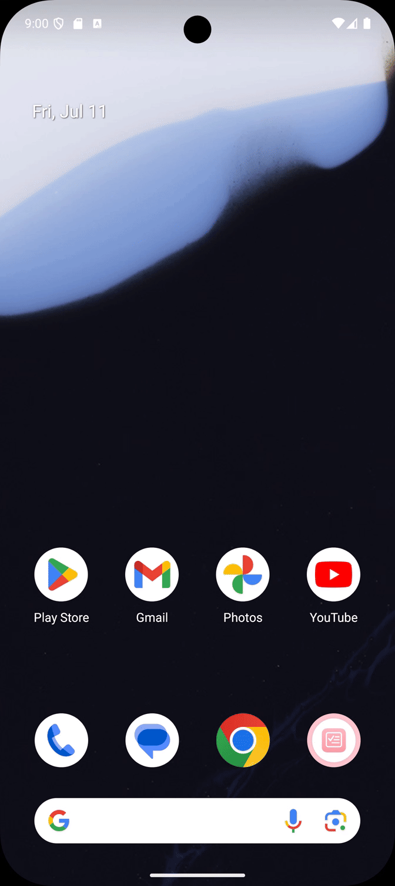
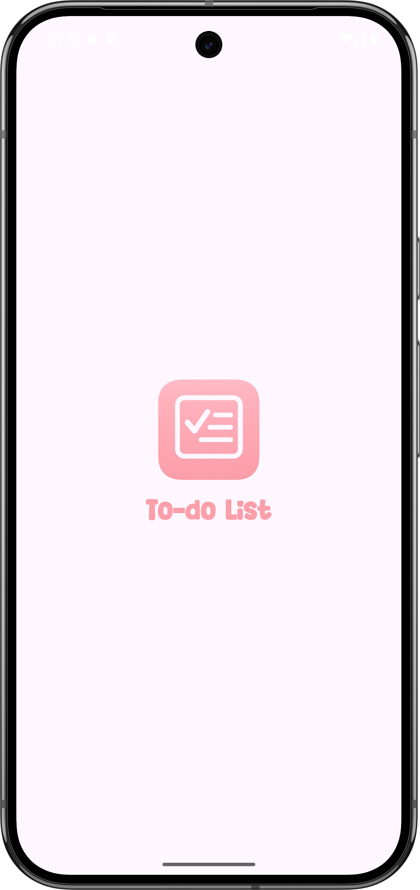
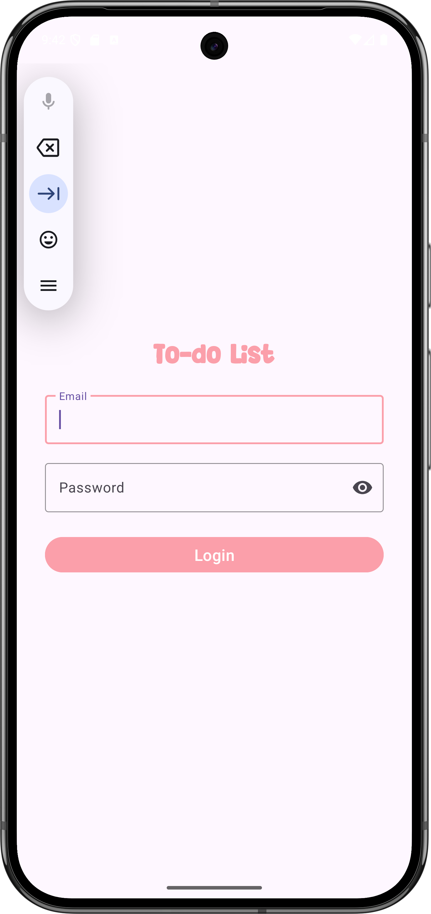
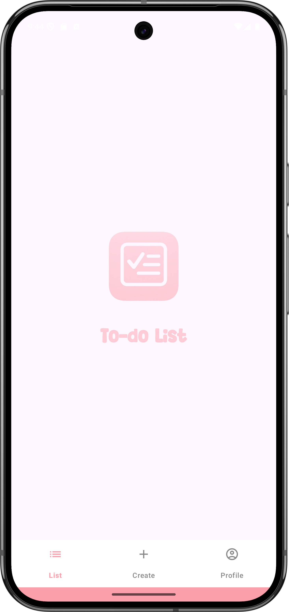
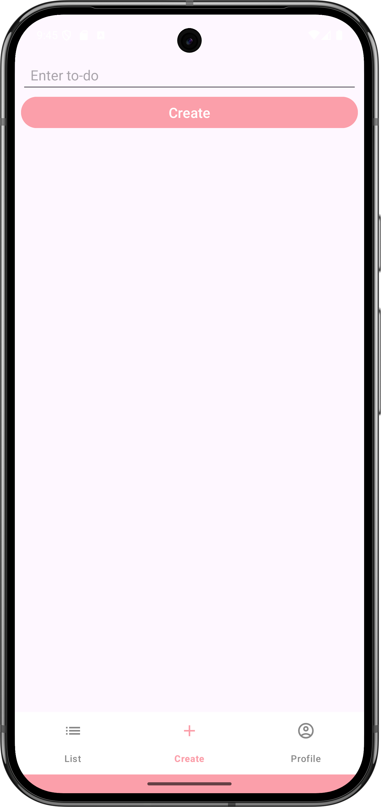
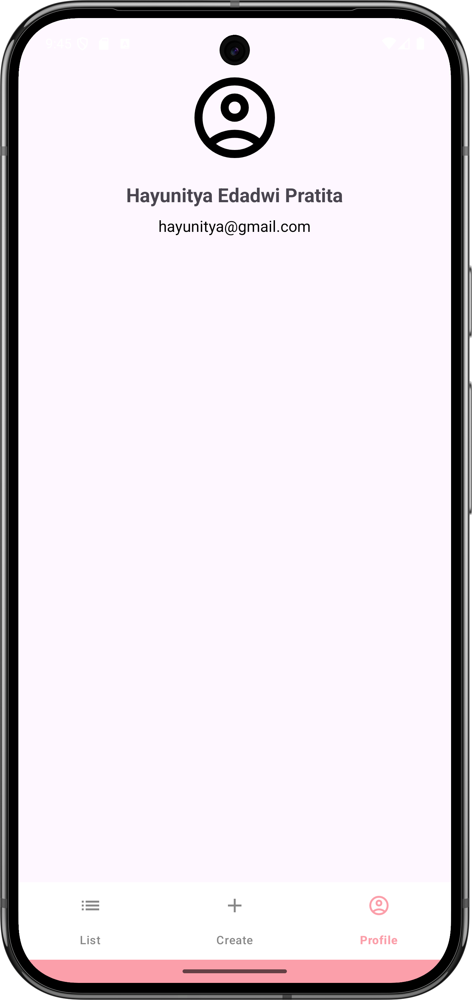

# Assignment 2 - To-do List
 

## 🎬 Demo

 

## 🖼️ Screenshots
<table>
  <tr>
    <td align="center">
      
🚀 Splash Activity

      
    </td>
    <td align="center">
      
🔐 Login Activity

      
    </td>
    <td align="center">
      
📋 List Fragment

      
    </td>
    <td align="center">
      
🧾 Create Fragment

      
    </td>
    <td align="center">
      
👤 Profile Fragment

      
    </td>
  </tr>
</table>
